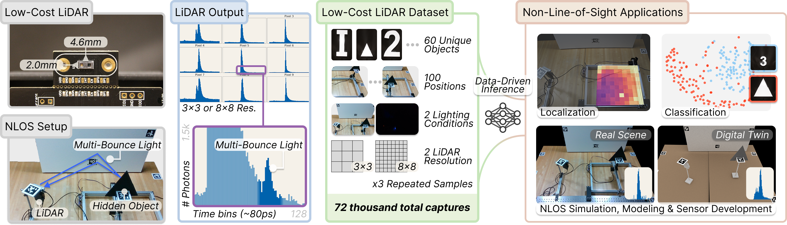
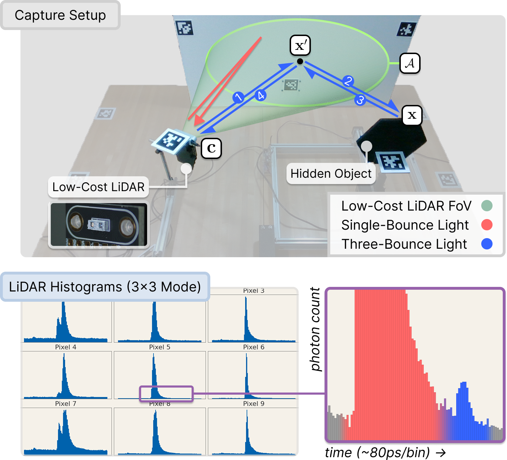

# DENALI: A Dataset Enabling Non-Line-of-Sight Spatial Reasoning with Low-Cost LiDARs

<p align="center">
  
</p>

> Behari, N., Rivero, D., Apostolides, L., Ghosh, S., Liang, P. P., & Raskar, R.
> *DENALI: A Dataset Enabling Non-Line-of-Sight Spatial Reasoning with Low-Cost
> LiDARs.* CVPR 2026 (Highlight).

DENALI is a dataset and benchmark for non-line-of-sight (NLOS) perception
using low-cost SPAD LiDARs. It captures 30 retroreflective objects across
two sizes, two grid resolutions (3x3 / 8x8), two lighting conditions, and
100 gantry locations, with calibrated AprilTag poses for both the SPAD and
a tracking RGB camera. This repository ships the captured data alongside
end-to-end code for capture, training, evaluation, real-time inference,
and a Mitsuba 3 digital-twin renderer.

## Capture setup



A low-cost SPAD LiDAR illuminates a relay wall; the third-bounce return
in each pixel histogram (the small bumps after the direct-return peak)
carries enough signal for compact 1D-CNNs to localize, classify, and
size-classify the hidden object.

## Dataset objects


The dataset spans 30 retroreflective shapes (10 letters, 10 numbers,
10 shapes) at two sizes (4 in. / 8 in.) with bundled ground-truth
meshes for digital-twin rendering.

## Layout

```
denali_public/
├── README.md
├── assets/         shared geometry, calibration, and figures
├── benchmark/      main benchmark table (Sec. 4) + generalization analyses (Sec. 7)
├── capture/        hardware capture rig: SPAD + dual-RealSense + 2D gantry
├── digitaltwin/    Mitsuba 3 + mitransient digital-twin renderer
├── gui/            live-inference web app over the captured 3x3 SPAD data
└── denali-data/    raw NLOS captures (downloaded separately, see below)
```

Each top-level folder is self-contained and installs from its own
dependency file.

## Data

Download `denali-dataset-cvpr2026.tar.gz` from the project page and
extract it inside `denali_public/`:

```bash
cd denali_public
tar xzf /path/to/denali-dataset-cvpr2026.tar.gz
```

The archive expands to a self-contained `denali-data/` with its own
`README.md` and `LICENSE`; every package in this repo reads from
`denali-data/data/` by default:

```
denali_public/denali-data/data/
├── A_4inch_3x3_lighton_NLOSdata/
├── A_4inch_3x3_lightoff_NLOSdata/
├── ...                                             (one folder per object × size × grid × light)
└── widerectangle_8inch_8x8_lighton_NLOSdata/
```

`benchmark/` reads from a pre-extracted joblib + `.npy` bundle at
`benchmark/saved_dataset/`. Build it once from the raw captures:

```bash
cd benchmark
python -m main_table.scripts.build_dataset \
    --data-dir   ../denali-data/data \
    --output-dir saved_dataset
```

The same `saved_dataset/` serves both `main_table` and `generalization`.

## Contents

| Folder                                  | Purpose                                                                                                      |
|-----------------------------------------|--------------------------------------------------------------------------------------------------------------|
| [`benchmark/`](benchmark/README.md)     | Main benchmark table (Sec. 4) and generalization analyses (Sec. 7).                                          |
| [`capture/`](capture/README.md)         | Drives the gantry, the TMF8828 SPAD, and the dual RealSenses to produce the raw `denali-data/data/` pickles. |
| [`digitaltwin/`](digitaltwin/README.md) | Renders the calibrated capture scene in Mitsuba 3 alongside the captured RGB and SPAD histogram.             |
| [`gui/`](gui/README.md)                 | Dash + Plotly web app that runs the three inference heads live over any capture in `denali-data/data/`.      |

`assets/` holds the shared geometry and calibration data: world-frame
AprilTag poses (`poses.json`), per-capture gantry positions
(`tag1_positions.json`), the GUI scene index (`manifest.json`), the
Mitsuba object meshes (`object_files/`), and the figures used in this
README (`images/`).

## Live demo

The Dash app in [`gui/`](gui/) runs the three pretrained inference heads
— object class, object size, and 2D location — live over the captured
3x3 SPAD histograms. Below: walking through 56 gantry locations for
object **9** at 8″ / lights on, then toggling each control:

<p align="center">
  
</p>

## Citation

```bibtex
@inproceedings{behari2026denali,
  title     = {{DENALI}: A Dataset Enabling Non-Line-of-Sight Spatial Reasoning with Low-Cost LiDARs},
  author    = {Behari, Nikhil and Rivero, Diego and Apostolides, Luke and Ghosh, Suman and Liang, Paul Pu and Raskar, Ramesh},
  booktitle = {Proceedings of the IEEE/CVF Conference on Computer Vision and Pattern Recognition (CVPR)},
  year      = {2026},
}
```
